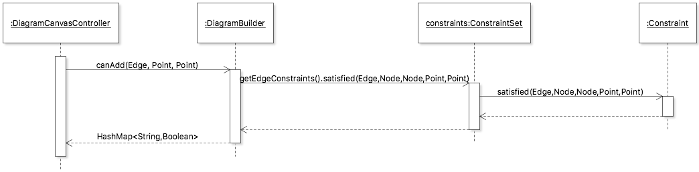
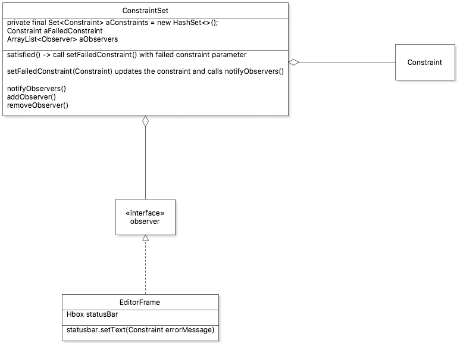
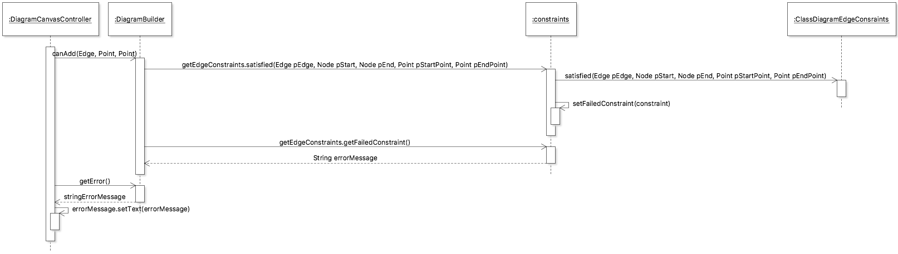
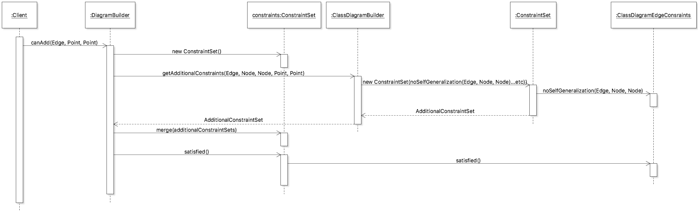
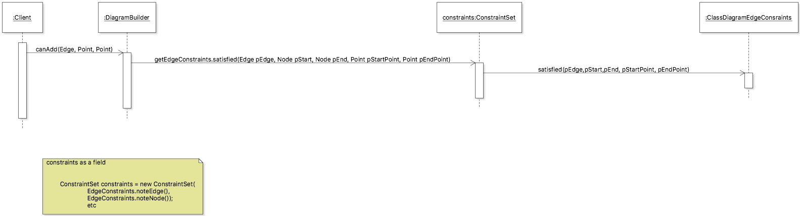

# Status bar for failed constraints

# Scope

When a user attempts to draw an edge that does not satisfy the edge constraints put in place, the status bar informs them which constraint failed. 

# Design 
Each `DiagramBuilder` intitializes a new `ConstraintSet` with a set of pre-determined constraints of type `Constraint`. The `satisfied` method in `ConstraintSet` then checks whether each `Constraint` meets the requirements to be drawn and returns `false` as soon as a constraint is not satisfied. This method gets called by `DiagramBuilder.canAdd()` which is first called inside `DiagramCanvasController`.For the status bar, `canAdd` gets a `HashMap<String,Boolean>` from `satisfied` in `ConstraintSet`. If the `HashMap` value is `false`, then it gets the key containing the error message called `failedConstraintError`. The error message for every `Constraint` is defined in JetUML.properties. This error message is then passed onto `DiagramTab` through a getter `getFailedConstraint` which then displays the text on the bottom of the `BorderPane` in a `HBox`. This process is better illustrated in the following sequence diagram:

)

## Passing the failed constraint to GUIt
The first challenge faced was deciding how to obtain the failed constraint and pass the information to the GUI. The first solution was to, of course, use an observer pattern. For this, the first two ideas were to either make `ConstraintSet` observable, or create another class that would get `constraintSet` data and be the observable object. Initially, it seemed that the second option would help with separation of concern. However, it would be a more complex solution with an extra unnecessary class. So, in the end, this was the initial observer pattern design that gives the GUI information on the failed constraint:
 

`EditorFrame` is added as an observer of `ConstraintSet` and adjusts the statusBar text as it gets notified. In practice, this fails because `constraintSet` gets initialized after `EditorFrame`. The issue here was that the observer being `EditorFrame` has a longer life span than the observable `constraintSet`. 

A possible idea was to make `constraintSet`a Singleton, and initialize it in `EditorFrame`. Then, set constraints in `DiagramBuilder` by getting the `constraintSet` instance. However, this could easily cause problems because each diagram gets initialized with a new `constraintSet` containing their pre-determined set of `Constraint`. Since we need `constraintSet` to have different set of constraints for each diagram, it would be a bad design to make it a singleton. 

The observer pattern between `constraintSet` and `EditorFrame` had to be abandoned since all trials lead to a dead end because the `constraintSet` needs to be initialized before `EditorFrame` to be an observable.  

The next best design is the current one where the failed constraint gets passed to `canAdd` which is then passed to `DiagramTab` through `DiagramCanvasController` as previously explained. 

Bad design containing message chain:

`DiagramTab` gets the error message through two different classes. 

To avoid this, `canAdd` returns a new `HashMap<String,Boolean>` each time it is called instead of just `boolean`. `DiagramCanvasController` then gets the error message and the boolean value all at once. However, this slightly renders performance because a new HashMap to return gets created each time the method is called. This much performance rendering can be neglected for now because of the refactoring done on `ConstraintSet` previously that will be discussed later. 

## Getting the String error message

The next challenge was to get the information on which exact constraint failed. This was not straightforward since `Constraint` is implemented with functional programming. It's not possible to get the `Constraint` name from the `satisifed` method in `ConstraintSet` because it returns a lambda expression. For example, if attempting to get the `Constraint` "ClassDiagramEdgeConstraints.noDirectCycles(DependencyEdge.class)" that failed, `.getName()` would return "ca.mcgill.cs.jetuml.diagram.builder.constraints.ClassDiagramEdgeConstraints$$Lambda$149/0x0000000800c57d90". This made it difficult to pass on the correct String error message to `DiagramCanvasController`.To solve this, the first solution would require getting rid of functional programming. That would make it easier to access the constraint names. However, this design would require lots of refactoring with changes in how paramateres are passed around, and would introduce complexity in constraint checking that functional programming eliminates. After some exploration, this idea was dropped because of the complexity it would create. 

The solution that was implemented refactors the return type of the functional interface method `satisfied`. Previously, `satisfied` would return a boolean value for each `Constraint`. Now, it returns a `HashMap` containing both the String error associated with the `Constraint` found in JetUML.properties and the boolean value for constraint satisfied or failed.

This design also eliminates the need to have a HashMap in `ConstraintSet` mapping each `Constraint` to it's associated error message in properties that was originally planned. Indeed, the initial plan was to find the failed constraint through `satisfied	` in `ConstraintSet`. This would then allow to look for the associated error message in a HashMap attribute in `ConstraintSet` that stores this information. However, that is no longer needed since `satisfied` is able to directly provide that information. 

This design is overall the best fit for the desired outcome. However, it does have a performance flaw. Each time a `Constraint` is checked, a new return HashMap is created. This renders performance with object creation. Once again, previous improvement for performance allows these smaller object creations to be neglected. 

## Previous work 

Previously, `canAdd` would create a new `ConstraintSet` when called. There was also method in `DiagramBuilder` called `getAdditonalConstraints` that would be called from `canAdd`. This method would also create a new `ConstraintSet` each time `canAdd` was called. Those two `ConstraintSet` were then combined using a `merge` method. After the refactoring work, `ConstraintSet` is now stored as a private static final field in each diagram builder. This reduces object creation by eliminating the need to create and merge new `ConstraintSet` objects each time `canAdd` is called. The merge method in `ConstraintSet` and `getAdditionalEdgeConstraints` method in `DiagramBuilder` were removed since they are no longer needed in the new design. `getAdditionalEdgeConstraints` allowed canAdd to gather all necessary constraints but at the cost of excessive object creation.

Now, `canAdd` can get all constraints for each diagram type with the method `getEdgeConstraints()`. The ConstraintSet field can be accessed by this method which simply returns the set of constraints. `Constraint.satisfied()` now takes in parameters in order to check the conditions as such: `satisfied(Edge pEdge, Node pStart, Node pEnd, Point pStartPoint, Point pEndPoint, Diagram pDiagramBuilder)`. 

Before refactoring:

After refactoring:

This refactoring work saved a lot of heavy object creation which now allows room for some extra object creations that were included in the design for a status bar. 
